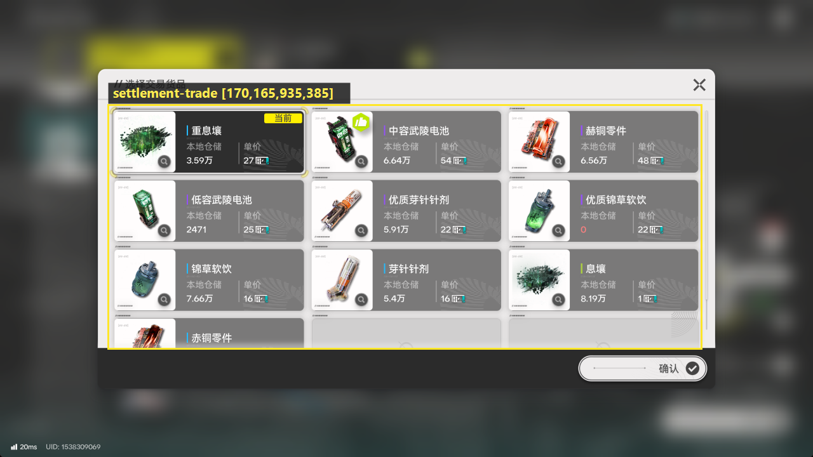
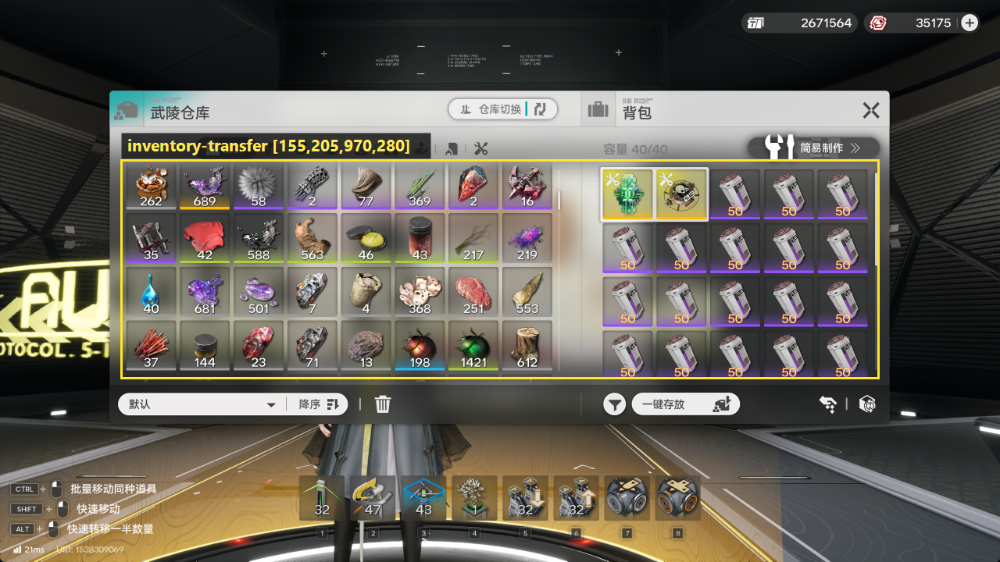
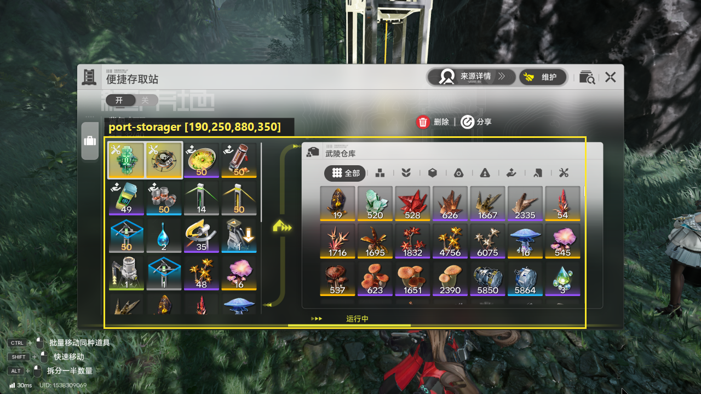
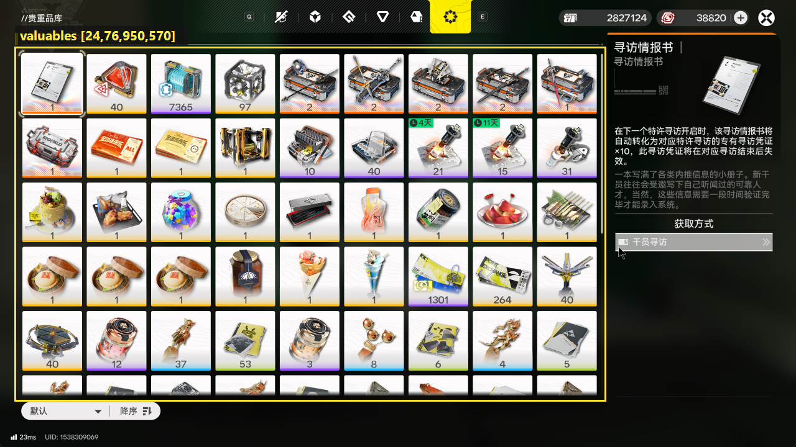
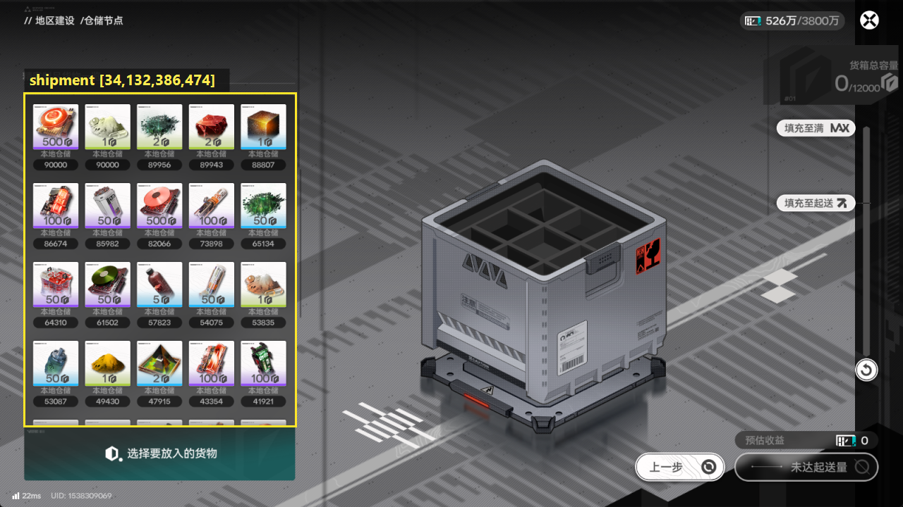
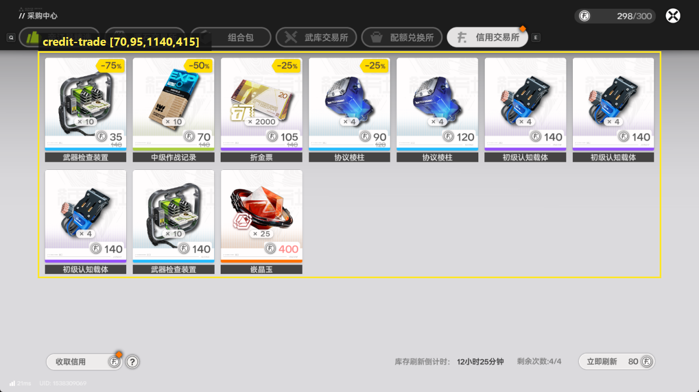
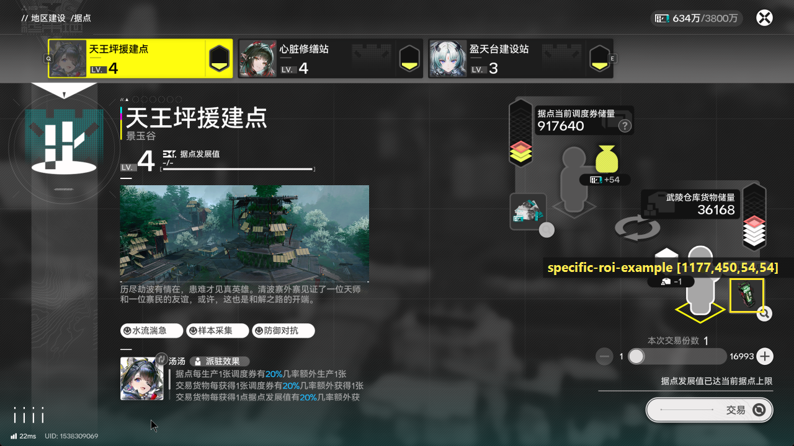

# 内部网格类型与参考 ROI

真实界面的网格定位是 `IconRecognition` 内部能力。调用方只需要选择与当前界面对应的 `grid_type` 并提供 Maa ROI，不应依赖内部 cell 尺寸、间距、分区或拟合过程。

| `grid_type` | 界面 | 默认候选 |
| --- | --- | --- |
| `trade` | 据点交易 | `Normal:Product`、`Normal:Usable` |
| `transfer` | 背包和仓库 | `Normal:*` |
| `port_storager` | 便捷存取站 | `Normal:*` |
| `valuables` | 贵重品库 | `ValuableDepot:*` |
| `shipment` | 送货界面 | `Normal:*` |
| `credit_trade` | 信用交易所 | `ValuableDepot:SpecialItem`、`Isolate:*` |
| `single_roi` | 临时单格 | `Normal:*` |

`single_roi` 会直接使用正方形 ROI 构造一个临时 cell，不执行真实网格检测。各界面的图标尺寸属于对应内部类型的实现特性，不应把其中某个尺寸泛化到其它类型。

## 双侧网格 ROI

`transfer` 和 `port_storager` 都支持两种 ROI：传入覆盖左右两侧网格的整块大 ROI 时，组件会在内部拆分并识别两侧；传入只覆盖左侧或右侧的 ROI 时，只识别该侧。实际流程通常分别处理两侧，建议按当前操作目标传入单侧 ROI。

单侧 ROI 仍使用 1280x720 画面上的绝对 Maa 坐标，不是相对于大 ROI 的局部坐标，并应完整覆盖目标侧需要识别的 cell。

## 参考 ROI

下表全部使用 1280x720 基准下的 Maa `[x,y,width,height]`。参考值需要与实际界面和图标位置对应，不是跨界面通用坐标。

| 界面 | 参考 ROI |
| --- | --- |
| 据点交易 | `[170,165,935,385]` |
| 背包和仓库 | `[155,205,970,280]` |
| 便捷存取站 | `[190,250,880,350]` |
| 贵重品库 | `[24,76,950,570]` |
| 送货界面 | `[34,132,386,474]` |
| 信用交易所 | `[70,95,1140,415]` |
| single ROI 示例 | `[1177,450,54,54]` |

示例保留完整 1280x720 截图，并在原图上框出 ROI：

