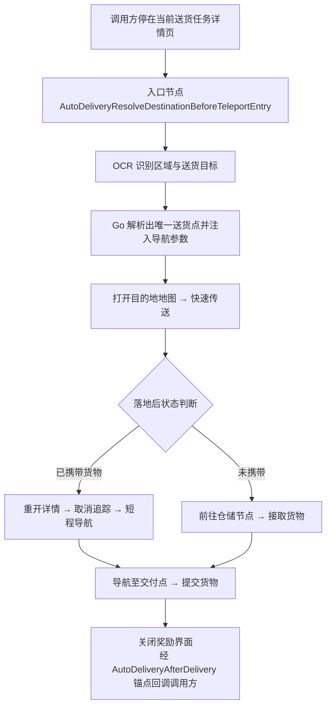

# 开发手册 - AutoDelivery 送货组件

## 1. 简介

AutoDelivery 封装运送委托接取后的公共送货流程：识别送货终点、打开任务位置、快速传送、前往仓储节点取货、导航至交付点并提交货物。

组件只负责送货流程本身。抢单、装箱接单、任务详情入口的选择以及任务级安全开关（如风险确认守卫）均由调用方负责。

## 2. 架构与数据流

| 路径 | 职责 |
| ----------------------------------------------- | ----------------------------------------------- |
| `assets/resource/pipeline/AutoDelivery/` | 取货、目的地识别、导航、提交和失败处理流程 |
| `assets/data/AutoDelivery/` | 送货点目录及人工校准后的 MapNavigator 路线 |
| `assets/resource/image/AutoDelivery/` | 携带状态、取货、提交货物和任务地图模板 |
| `agent/go-service/autodelivery/` | OCR 文本匹配、目的地解析和导航参数注入 |

Pipeline 负责界面流程；Go Action `AutoDeliveryResolveDestinationAction` 只负责把 OCR 结果解析成唯一送货点，并在运行时完整覆写 `AutoDeliveryNavigate` 与 `AutoDeliveryRetryNavigate` 的 `MapNavigateAction` 参数——JSON 里这两个节点的参数只是占位：



## 3. 快速接入

调用完整送货前，必须已经停在**当前送货任务的详情界面**——组件的 OCR 节点要在该页面上识别区域与目标文本。如何到达详情页由调用方自行实现。

### 第 1 步：注入「重新打开任务详情」子任务

流程中会多次离开并重开任务详情，调用方必须覆写 `AutoDeliveryOpenCurrentJobDetail.custom_action_param`，提供一个可重复调用的子任务；成功时停在任务详情界面，失败时返回失败：

```json
{
    "AutoDeliveryOpenCurrentJobDetail": {
        "custom_action_param": {
            "sub": [
                "MyTaskOpenCurrentDeliveryJob"
            ],
            "continue": false,
            "strict": true
        }
    }
}
```

### 第 2 步：声明回调锚点

组件在几个关键阶段留有可选出口：把锚点指向某个节点，流程走到该阶段时就会转交出去，相当于**提前结束送货**；显式写空字符串 `""` 表示不走该出口，继续默认的完整送货路径。不要省略键名——锚点是任务运行期的全局状态，会被后执行的节点覆盖；抢委托等循环场景中，上一轮可能在组件内部留下指向。

| 锚点 | 出口位置 | 典型用法 |
| ----------------------------------------- | -------------------------------- | -------------------------------- |
| `AutoDeliveryAfterQuickTeleport` | 快速传送落地后 | 非必填。「仅传送」模式在此收尾；完整送货时不声明或写 `""`，继续判断取货区域 |
| `AutoDeliveryAfterWalkToDepot` | 走到仓储节点后 | 非必填。「走到仓储节点」模式在此收尾；完整送货时不声明或写 `""`，继续接取货物 |
| `AutoDeliveryAfterDelivery` | 提交货物并关闭奖励界面后 | 送达必经回调：指向调用方收尾节点，如抢委托回主循环、转交委托回仓储循环 |
| `AutoDeliveryAfterDeliveryFallback` | 送达回调因 `max_hit` 等原因不可执行时 | 兜底去向，避免送达后流程无路可走；通常指向任务结束节点 |

### 第 3 步：严格调用完整入口

建议使用严格 `SubTask` 调用完整流程，内部任一环节失败或超时都会传播到 `on_error`：

```json
{
    "MyTaskRunAutoDelivery": {
        "recognition": "DirectHit",
        "action": "Custom",
        "custom_action": "SubTask",
        "custom_action_param": {
            "sub": [
                "AutoDeliveryResolveDestinationBeforeTeleportEntry"
            ],
            "continue": false,
            "strict": true
        },
        "next": [
            "MyTaskDeliveryDone"
        ],
        "on_error": [
            "MyTaskDeliveryFailed"
        ]
    }
}
```

参考实现：`SeizeDeliveryJobs/AutoDeliveryAdapter.json` 与 `DeliveryJobs/AutoDelivery.json` 两个适配层；契约由 `tools/pipeline-generate/DeliveryJobs/data.test.mjs` 的 `AutoDelivery exposes a task-neutral delivery contract` 测试固化。

## 4. 启用滑索（`zip` 参数）

组件在流程的不同阶段都会解析送货终点，每次解析都以所在节点自带的 `custom_action_param.zip` 重新注入导航参数。该参数为可选布尔值，默认 `false`；设为 `true` 时首次导航会向 `MapNavigateAction` 请求启用滑索规划。携带此参数的解析节点有三处：

- `AutoDeliveryResolveDestinationBeforeTeleport`——主入口传送前的首次解析；
- `AutoDeliveryResolveDestinationAfterTeleport`——快速传送落地后的再次解析；
- `AutoDeliveryRunDeparture`——从任务详情页直接出发时的解析。

由于每次解析都会整包重写导航参数，**三处必须设同一值**：漏配任一处，后续分支就会以默认 `false` 覆盖先前的设置。开启方式是用任务选项同时覆写三个节点（两个任务中「优先使用滑索」选项的 Yes 分支正是这么实现的）：

```json
{
    "AutoDeliveryResolveDestinationBeforeTeleport": {
        "custom_action_param": { "zip": true }
    },
    "AutoDeliveryResolveDestinationAfterTeleport": {
        "custom_action_param": { "zip": true }
    },
    "AutoDeliveryRunDeparture": {
        "custom_action_param": { "zip": true }
    }
}
```

另有两点行为须知：

- **重试导航始终不用索**：短程补走距离很近，Go 注入参数时对 `AutoDeliveryRetryNavigate` 硬编码 `zip: false`；
- **是许可不是命令**：最终是否走索仍受全局滑索偏好（`auto` / `always` / `never`）覆盖，且规划器只在滑索已供电、可上下索且预计更快时选用。

## 5. 调用方边界

- 致命错误节点统一通过 `FalseAction` 返回失败，不要覆写内部错误节点来改变流程。
- 不要覆写 `AutoDeliveryNavigate` / `AutoDeliveryRetryNavigate` 的参数，它们会在运行时被 Go 整包替换。
- 不得引用 `__AutoDelivery*` 私有节点。
- `SeizeDeliveryJobs` 只负责筛选和接取委托，从运送委托列表打开任务详情；`DeliveryJobs` 只负责仓储装箱、接单，从本地仓储节点点击「查看任务」。

## 6. 维护目的地

- `delivery_destinations.json` 由 `tools/pipeline-generate/data/scripts/delivery_destinations_data.py` 从游戏数据与 BaseNav 元数据生成。
- `destinations.json` 保存业务 ID、区域公共前缀、送货点独有接续路线、坐标覆盖和 `target_deck_y`。
- Go 解析器先按地区缩小候选，再对目的地文本做容错匹配；匹配不唯一或低于阈值时直接失败，不猜测终点。
- 导航仍由 `MapNavigateAction` 执行。纯移动优先使用 `NAVMESH`，复杂路段按 [MapNavigator 文档](./map-navigator.md) 配置必要航点。
