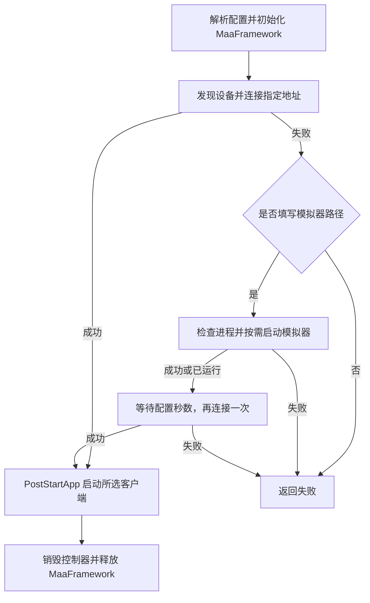

# StartGame 启动游戏前置任务

本文说明 `StartGame`（🚀启动游戏）前置任务的实现、配置与运行边界。

## 功能与入口

`StartGame` 在客户端正式连接控制器之前执行。Win32 模式启动配置的 PC 程序；ADB 模式先连接指定设备，连接失败时才启动模拟器、等待并重新连接，最后打开所选 Android 客户端。

云终末地的“开始游戏”按钮由后续 `OpenGame` Pipeline 识别并点击；单独执行此前置任务只会打开云客户端。五语言任务名称统一使用 🚀 图标，与现有任务通过名称前缀展示 Emoji 的方式一致。

调用链为：

```text
assets/interface.json 导入 tasks/pretasks/StartGame.json
  → 客户端运行 agent/go-service --pretask StartGame <选项 JSON>
  → main.go 分派到 pretask.Run
  → 注册表中的 StartGame 处理器 startgame.Run
  → 成功正常退出，失败退出码为 1
```

这是独立进程形式的 pretask，使用 `pretask.Register` 注册，不经过 Agent Socket，也不是 Pipeline Custom Action，因此没有新增 Custom Action / Recognition Schema。

## 文件职责

| 文件 | 实现内容 |
| --- | --- |
| `agent/go-service/pretask/pretask.go` | 在现有注册表中增加 `StartGame` 处理器 |
| `agent/go-service/pretask/startgame/startgame.go` | 解析配置、选择启动分支、解析可执行文件路径、检查进程并启动程序 |
| `agent/go-service/pretask/startgame/android.go` | 客户端版本映射、MaaFramework 初始化、ADB 设备选择、连接及应用启动 |
| `agent/go-service/pretask/startgame/launch_windows.go` | Windows 参数拆分及子进程创建标志 |
| `agent/go-service/pretask/startgame/launch_other.go` | 非 Windows 参数拆分；进程配置函数为空实现 |
| `assets/tasks/pretasks/StartGame.json` | 前置任务入口、控制器过滤和输入选项 |
| `assets/interface.json` | 导入前置任务配置 |
| `assets/locales/interface/{zh_cn,zh_tw,en_us,ja_jp,ko_kr}.json` | 五语言任务名称、图标、说明及选项文案 |

## 配置解析

`optionsFromArgs` 将收到的最后一个参数解析为 JSON；缺少参数、JSON 格式错误或字段类型不符都会失败。

| JSON 字段 | 用途与限制 |
| --- | --- |
| `StartGamePCPath.Path` | Win32 可执行文件路径，不能为空 |
| `StartGamePCPath.Args` | PC 启动参数，可为空 |
| `StartGameEmulatorPath.Path` | 模拟器可执行文件路径；首次 ADB 连接成功时允许为空 |
| `StartGameEmulatorPath.Args` | 模拟器启动参数，可用于选择实例 |
| `StartGameADB.Address` | 必填，精确匹配设备发现结果中的地址 |
| `StartGameADB.WaitSeconds` | 字符串形式的非负整数秒数；空值默认 `30`，允许 `0`，拒绝溢出 `time.Duration` 的值 |
| `ClientVersion` | 普通 Android 客户端版本，空值按 `CN` 处理 |
| `ClientVersionCloudLocked` | 非空时覆盖 `ClientVersion`，现有 CloudADB 选项固定为 `Cloud` |

控制器类型优先来自 `pienv.ControllerType()`，即 `PI_CONTROLLER` 的 `type`，经过去除首尾空白和转小写后，仅接受 `win32` 与 `adb`。界面中的 `Win32-Front`、`ADB`、`CloudADB` 是控制器名称，不能直接当作类型传入。

如果环境没有提供类型，则根据选项对象推断：仅存在 `StartGamePCPath` 时视为 Win32，仅存在 `StartGameEmulatorPath` 时视为 ADB；两者同时存在或都不存在会失败。因此，该兼容逻辑依赖客户端在序列化前按控制器过滤选项。

路径输入会去除首尾空白，以及 Windows“复制文件地址”带上的一对外层双引号。ADB 即使不需要启动模拟器，也仍要求存在 `StartGameEmulatorPath` 对象，并会先解析其中的参数和等待时间。

## 程序启动与进程去重

`launchProgram` 先将路径转为绝对路径、解析符号链接，并确认目标是普通文件。相对路径基于前置任务进程当前工作目录解析；不会按程序名称搜索 `PATH`。

随后通过 `gopsutil/process` 枚举进程：

1. 读取进程可执行文件路径，尽可能解析符号链接后比较。Windows 路径比较忽略大小写，其他平台区分大小写。
2. 未填写启动参数时，只要路径相同就跳过启动，不检查已有进程的参数。
3. 填写了启动参数时，要求已有进程除 `argv[0]` 外的参数与解析结果逐项、按顺序完全相同，才跳过启动。
4. 无法读取无关进程的路径时忽略该进程；若进程名与目标文件名相同且不能确认其已退出，则返回错误，避免在无法确定身份时重复启动。读取匹配路径进程的参数失败时也采用类似处理。

需要启动时使用 `exec.Command(path, args...)`，工作目录设为可执行文件所在目录，不经过 shell。标准输入输出未连接到前置任务的管道；`Start` 成功后释放进程句柄，不等待应用退出。释放句柄失败只记录警告，不改变启动成功结果。

### 平台差异

Windows 文件通过 `_windows.go` 后缀参与条件编译。`parseArguments` 使用 `windows.DecomposeCommandLine`，先添加占位程序名再移除解析结果的首项，避免 Windows 对 `argv[0]` 的特殊处理影响用户参数。创建标志为 `DETACHED_PROCESS | CREATE_NEW_PROCESS_GROUP`，使子进程脱离前置任务的控制台和 Ctrl+C 进程组。

非 Windows 文件使用 `//go:build !windows`。参数解析支持空白分隔、单引号、双引号、转义和空字符串参数；拒绝 NUL、未闭合引号及末尾不完整转义。该解析器不会展开环境变量、通配符或命令替换。非 Windows 分支没有设置额外的会话或进程组隔离。

## ADB 启动流程



MaaFramework 库目录优先读取 `MAAFW_BINARY_PATH`，否则使用 `fsutil.OutputPath("maafw")`。框架日志目录为 `fsutil.OutputPath("debug", "startgame")`。

`connectAndroidDevice` 先调用 `maa.FindAdbDevices()`，再从结果中寻找 `Address` 完全一致的设备。它使用该设备的 ADB 路径、截图方式、输入方式和配置创建临时控制器，Agent 二进制目录设为库目录下的 `MaaAgentBinary`。没有地址别名转换、设备名称匹配或其他地址回退；填写的地址必须能出现在设备发现结果中，并与 MXU 选择的目标设备一致。

连接通过 `PostConnect().Wait().Success()` 判断。首次连接失败后，只有成功执行 `launchProgram` 才会等待并重连；即使模拟器已运行而跳过了进程启动，这次等待和重连仍会执行。首次连接成功则跳过模拟器可执行文件的存在性检查、进程启动和等待；连接前的选项解析仍会执行。

等待使用用户配置的 `time.Sleep(opts.Wait)`，只在首次连接失败分支执行。它不是设备就绪轮询，也不是整个前置任务的超时。等待结束只重连一次，失败直接返回。

临时控制器由当前进程创建并持有，不属于 Custom 回调中的借用句柄。连接失败的控制器及时销毁；成功连接的控制器在函数结束时销毁，再释放 MaaFramework。启动应用使用 `PostStartApp(intent).Wait().Success()`，启动作业失败会返回错误。

### Android 客户端映射

| 版本 | 启动 Intent |
| --- | --- |
| 空值 / `CN` | `com.hypergryph.endfield/com.u8.sdk.U8UnityContext` |
| `Bilibili` | `com.hypergryph.endfield.bilibili/com.u8.sdk.U8UnityContext` |
| `Global` | `com.gryphline.endfield.gp/com.u8.sdk.U8UnityContext` |
| `VN` | `com.hypergryph.endfield.vn/com.u8.sdk.U8UnityContext` |
| `Cloud` | `com.hypergryph.cloud.endfield/com.hypergryph.cloud.endfield.splash.SplashActivity` |

其他版本值返回错误。这份映射与 `assets/tasks/AndroidOpenGame.json` 中的客户端选项重复维护，修改包名或入口 Activity 时需要同步更新。

## 运行边界

使用和维护时需要注意以下行为：

- **云游戏点击依赖后续流程。** `startAndroidGame` 在 `PostStartApp` 成功后即返回。`assets/resource/pipeline/OpenGame.json` 的 `CloudEndfieldStartGame` 等节点负责后续操作，必须执行到对应 Pipeline 才能完成“开始游戏”的点击。
- **启动成功不等于游戏就绪。** PC 分支仅确认进程创建成功或存在匹配进程，不等待窗口、不激活窗口，也不处理启动器内的按钮。Android 分支仅确认应用启动作业成功，不确认进入游戏世界。
- **等待时间不自适应。** 模拟器启动较慢时，固定等待后仍可能连接失败；很快就绪时也会等待完整时长。当前没有轮询或进一步重试。
- **去重取决于进程暴露的路径和参数。** 使用会转交请求后退出的启动器，或运行时改变命令行的程序时，后续调用不一定能够匹配原先的启动参数。权限不足也可能使去重检查直接失败。
- **设备发现是连接的前提。** 即使填写了地址，代码也不会绕过 `FindAdbDevices` 直接为未发现的地址构造连接；发现失败与连接失败都会进入模拟器启动分支。

## 验证建议

实机验证应覆盖 PC 重复启动、带参数的模拟器多实例、ADB 首次连接成功、连接失败后的模拟器启动、错误地址及 CloudADB 后续 Pipeline 衔接。检查进程是否启动和检查游戏界面是否就绪应分别进行。

修改后按项目约定运行对应格式化命令：`pnpm format`（JSON）、`pnpm format:go`（Go）、`pnpm format:md`（Markdown）。`pnpm check` / `pnpm test` 默认交由 CI；修改 `tests/**` 或用户明确要求时按仓库规范执行本地验证。
